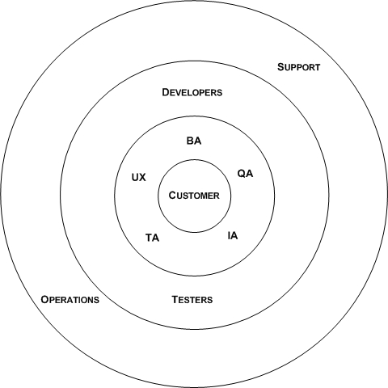

This is another drawing that I use alot while coaching agile projects and actually is part of multiple discussions around agile methods.  Most agile methods talk about stories being created by the customer and put on a backlog.  For some iteration, at iteration planning, the story gets explained to developers and testers.  They work on the story until it is complete.  And we have lots of conversations, as agile coaches and teams, about "when is a story complete".

This misses alot of the work that needs to be done in order to make teams effective. I like to have regular backlog grooming meetings with part of the team and ask the question - _**is this story prepared?**_.  _**What is needed in order to bring this story to iteration planning?**_ That needed work might involve QA (quality assurance) for acceptance tests or functional tests.  That might involve UX (user experience) for wireframes or drawings.  That might involve some TA (technical architecture) work or IA (information architecture, or domain modeling) work depending on the story.  It might require a BA to work out the business value of this story or how to break it up into what needs to done now versus later (breaking up stories into smaller, potentially optional pieces).  Its only when a story is prepared that it should be brought to iteration planning.

I also use this picture to help explain why some work is "on the board" for the iteration (meaning we are tracking velocity and burndown charts - its the developer/tester circle) vs work that needs to get done but we aren't measuring velocity for it.  The first is working towards completing the story.  The latter is working towards getting the story prepared.

It also helps explain the roles of the non-customer, non-developer and non-tester folks...though I'm pretty careful to explain that that 2nd circle is optional work (story by story) and that that work can be done by anyone with those skills.  Its really about what would make the communication of this story effective and doing that in as lightweight of a fashion as you need.

The last part of this drawing is that the story doesn't stop because development is done.  Its really done when its deployed (some would say deployed to production) and supported.  This means that the story needs to be shared with operations and support teams.  I've seen this done as part of a release process and actually made it the responsibility of the whole team to figure how to to communicate the stories that are being released.  Really each circle needs to figure out when its done with the story and how to communicate to the next circle (and then there are feedback loops!).

Its really about effective communication and community.  I didn't get this last part until attending a session with [David Hussman](http://www.devjam.com/presentations/) who talks about building community around a story.
